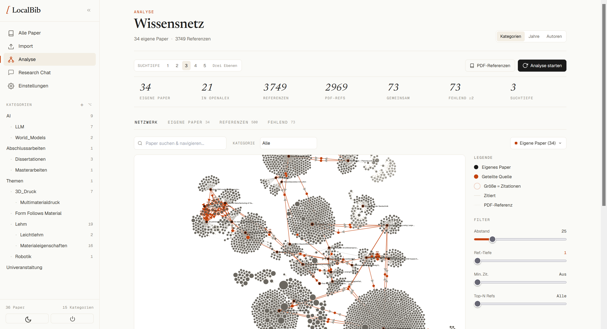
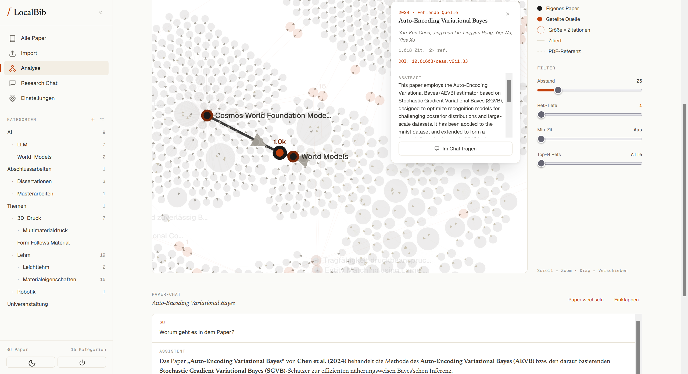
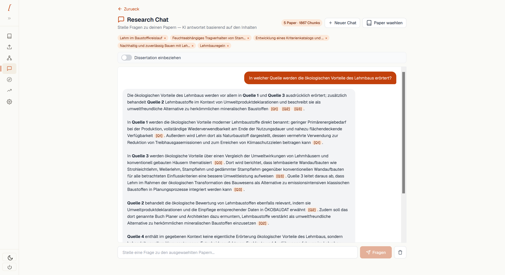
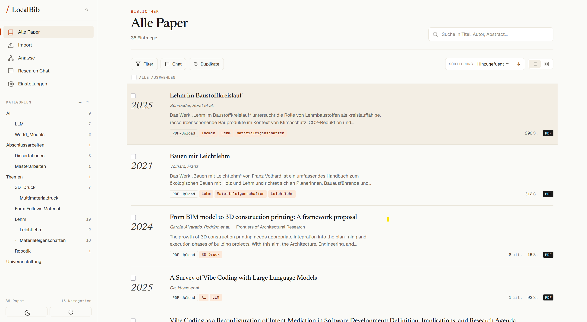
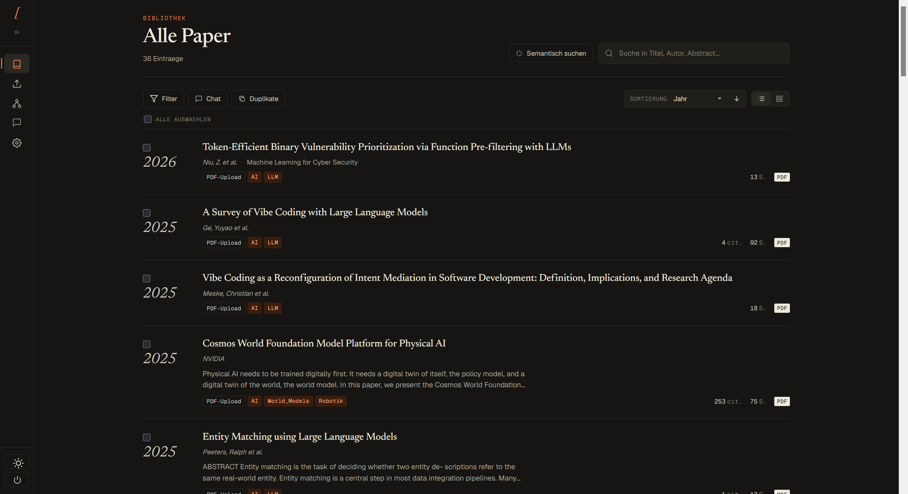

# LocalBib

**Automatisches Tagging und Kategorisierung wissenschaftlicher PDFs** — für
Promovierende, Studierende und alle, die eine wachsende PDF-Sammlung
durchsuchbar und kategorisiert halten wollen, ohne sich in einen
Cloud-Referenzmanager einzuloggen. PDFs landen in einem Ordner, LocalBib
erkennt die DOI, holt Titel/Autoren/Abstract von CrossRef, lässt ein LLM
deiner Wahl die Kategorien zuweisen und legt Symlinks in deiner eigenen
Ordnerstruktur an. Alles läuft lokal, auf deinem Rechner, in deiner eigenen
SQLite-Datenbank.

**Quellcode (AGPL-3.0)** — frei nutzbar, selbst hostbar, kein Feature-Gating,
kein Zwangs-Account. Ein vorcompiliertes **Windows-Installationsprogramm
(.exe)** ist als Convenience-Build erhältlich, für alle, die kein Python
aufsetzen wollen.

---

## Screenshots

<p align="center">
  <a href="static/screenshots/wissensnetz.png">
    
  </a><br>
  <sub><b>Wissensnetz</b> — was deine Sammlung zitiert und wo sie sich überschneidet.
  Suchtiefe 1–5, gemeinsame Quellen hervorgehoben, fehlende Paper sichtbar.</sub>
</p>

<table>
  <tr>
    <td width="50%" valign="top">
      <a href="static/screenshots/paper-chat.png">
        
      </a><br>
      <sub><b>Paper-Chat aus dem Graphen</b> — Knoten anklicken, Abstract lesen,
      direkt zu diesem Paper weiterfragen.</sub>
    </td>
    <td width="50%" valign="top">
      <a href="static/screenshots/research-chat.png">
        
      </a><br>
      <sub><b>Research Chat</b> — Fragen über mehrere Paper hinweg, jede Aussage
      mit Beleg auf die Textstelle, aus der sie stammt.</sub>
    </td>
  </tr>
  <tr>
    <td width="50%" valign="top">
      <a href="static/screenshots/bibliothek.png">
        
      </a><br>
      <sub><b>Bibliothek</b> — jedes Paper mit Jahr, Autoren, Abstract-Anriss und
      automatisch vergebenen Kategorien; die Sidebar zählt mit.</sub>
    </td>
    <td width="50%" valign="top">
      <a href="static/screenshots/bibliothek-dark.png">
        
      </a><br>
      <sub><b>Dunkler Modus</b> — dieselbe Ansicht nachts, inklusive semantischer
      Suche, die auch ohne wörtliche Treffer findet.</sub>
    </td>
  </tr>
</table>

---

## App herunterladen (Windows-Installer)

> **Fertiges Windows-Programm — kein Python, kein Terminal nötig.**

**14 Tage kostenlos testen, ganz ohne Lizenzschlüssel.** Lade den Installer
herunter, installiere und nutze alle Funktionen 14 Tage lang uneingeschränkt.

[**LocalBib kaufen (29,50 € einmalig)**](https://buy.polar.sh/polar_cl_ElgxYcLFsyVN4g0xWdBBGEV0tVh92y7XskHaS1hDgBD)

Danach fragt die App einmalig nach einem Lizenzschlüssel:

- **29,50 € einmalig**, keine Abo, lebenslange Updates inklusive.
- Ein Schlüssel gilt für **2 Geräte** (Aktivierungen).
- Der Schlüssel wird **genau einmal** gegen den Polar-Store geprüft — danach
  läuft LocalBib **für immer offline weiter**, ohne erneute Prüfung, ohne
  Internetzwang, ohne Telemetrie.
- Kein Kauf-Zwang zum Ausprobieren: der 14-Tage-Trial läuft ohne jede
  Registrierung.

Der Installer selbst liegt als GitHub-Release-Asset `LocalBib-Setup-<version>.exe`
bei den [Releases dieses Repositories](https://github.com/tobiasbartlog/localbib/releases) —
öffentlich einsehbar, jederzeit nachprüfbar gegen den zu diesem Tag gehörenden
Quellcode-Stand.

### Der SmartScreen-Hinweis

Der Installer ist **nicht codesigniert** (Code-Signing kostet laufend Geld, das
ein Solo-Projekt vor dem ersten Umsatz nicht ausgeben möchte). Windows zeigt
deshalb beim ersten Start SmartScreen:

1. **"Der Computer wurde durch Windows geschützt"**
2. Klicke auf **"Weitere Informationen"**
3. Klicke auf **"Trotzdem ausführen"**

Das ist normal für unsignierte, aber quelloffene Software — der komplette
Quellcode liegt in diesem Repository und kann jederzeit geprüft werden. Wer
dem Installer grundsätzlich nicht vertrauen möchte: siehe unten, Self-Host aus
dem Quellcode braucht keinen Installer.

---

## Features

- **Watchdog**: Input-Ordner überwachen – PDFs rein, fertig
- **DOI-Extraktion**: Automatische DOI-Erkennung + CrossRef-Metadaten (Titel, Autoren, Abstract, ...)
- **OCR-Fallback**: Text auch aus gescannten PDFs
- **LLM-Kategorisierung**: Automatische Zuordnung zu Kategorien über den LLM-Anbieter deiner Wahl
- **Zitationsnetzwerk**: Verwandte Paper über OpenAlex entdecken
- **Semantische Suche**: Hybrid aus Embeddings + BM25 (optional, nur mit konfiguriertem Embedding-Modell)
- **SQLite-Datenbank**: Alle Metadaten + Zuordnungen, keine Cloud
- **Symlinks**: Kategorie-Ordner mit Verknüpfungen zu den PDFs
- **BibTeX-Export**: Direkt aus der DB exportieren
- **Automatische Umbenennung**: `YYYY_Nachname_Titel.pdf`

---

## Self-Host (Python) — nie gated, nie im Trial, nie nach einem Schlüssel gefragt

Ein Self-Host-Install aus dem Quellcode ist an keiner Stelle an Trial oder
Lizenzschlüssel gebunden — die AGPL-Freiheiten bleiben real, nicht nur auf
dem Papier.

### Installation

```bash
# Repository klonen
git clone https://github.com/tobiasbartlog/localbib.git
cd localbib

# Dependencies installieren
pip install -r requirements.txt

# Optional für Windows-Verknüpfungen:
pip install pywin32

# .env Datei anlegen
copy .env.template .env   # Windows
cp .env.template .env     # Linux/Mac
```

### Bring your own LLM key

LocalBib liefert **bewusst keinen** LLM-Anbieter und **keinen** API-Key mit —
du bringst deinen eigenen mit, bei einem Anbieter deiner Wahl. Beim ersten
Start fragt das Onboarding danach; das lässt sich auch überspringen (die App
bleibt nutzbar, nur die LLM-Funktionen bleiben dann aus) und jederzeit später
in der `.env` oder unter Einstellungen nachtragen:

| Anbieter | `LLM_PROVIDER` | Key holen |
|----------|----------------|-----------|
| OpenAI | `openai` | https://platform.openai.com/api-keys |
| OpenRouter (viele Modelle, ein Key) | `openrouter` | https://openrouter.ai/keys |
| Groq | `groq` | https://console.groq.com/keys |
| DeepSeek | `deepseek` | https://platform.deepseek.com/api_keys |
| Mistral | `mistral` | https://console.mistral.ai/api-keys |
| Lokal/eigener Endpunkt (z. B. Ollama) | `custom` + `LLM_BASE_URL` | — |

```
LLM_PROVIDER=openai
LLM_API_KEY=dein-key
LLM_MODEL=gpt-4o
```

Zusätzlich frei lassbar (aber empfohlen): `CROSSREF_MAILTO` — deine eigene
E-Mail-Adresse für den "polite pool" von CrossRef/OpenAlex (bessere
Rate-Limits). Leer lassen heißt: es wird keine Adresse mitgeschickt, kein
Ersatzwert wird untergeschoben.

### Web-UI starten

```bash
python webapp.py
# → Browser öffnen: http://localhost:8000
```

### Schnellstart (CLI)

```bash
# 1. Datenbank + Kategorien initialisieren
python literature_manager.py init

# 2. PDFs in Input-Ordner legen
#    Standard: ~/Literatur/input/

# 3a. Einmalig importieren
python literature_manager.py import

# 3b. ODER: Ordner dauerhaft überwachen
python literature_manager.py watch
```

### Ordnerstruktur

```
~/Literatur/
├── input/                  ← PDFs hier reinwerfen
├── all/                    ← Alle PDFs (umbenannt)
├── kategorien/
│   ├── Themen/
│   │   ├── Lehm/           ← Symlinks
│   │   ├── 3D_Druck/
│   │   ├── Materialeigenschaften/
│   │   └── Dissertationen/
│   ├── AI/
│   │   ├── LLM/
│   │   └── World_Models/
│   └── Dissertationen_Sammlung/
├── literatur.db            ← SQLite-Datenbank
└── literatur.bib           ← BibTeX (nach Export)
```

### Alle Befehle

| Befehl | Beschreibung |
|--------|-------------|
| `init` | Datenbank + Standardkategorien erstellen |
| `import` | PDFs aus Input-Ordner verarbeiten |
| `watch` | Input-Ordner dauerhaft überwachen |
| `list` | Alle Paper anzeigen |
| `search "query"` | Paper suchen |
| `categories` | Kategorien anzeigen |
| `add-cat "Name" --parent ID --desc "..." --keywords "..."` | Neue Kategorie |
| `bibtex [--output file.bib]` | BibTeX exportieren |
| `rebuild` | Ordner + Symlinks neu aufbauen |
| `stats` | Statistiken |

### Optionen

```bash
# Anderes Basis-Verzeichnis
python literature_manager.py --dir "D:/Dissertation/Literatur" init

# Verbose/Debug-Modus
python literature_manager.py -v watch
```

### Kategorien verwalten

```bash
# Neue Unterkategorie hinzufügen (parent=1 ist "Themen")
python literature_manager.py add-cat "Nachhaltigkeit" --parent 1 --desc "EPD, LCA, Ökobilanz" --keywords "sustainability, LCA, EPD, carbon"

# Neue Oberkategorie
python literature_manager.py add-cat "Methodik" --desc "Forschungsmethoden"
```

### Pipeline

```
PDF im Input-Ordner
  → SHA256-Hash (Duplikat-Check)
  → Text extrahieren (PyMuPDF)
  → DOI per Regex suchen
  → CrossRef API → Metadaten (Titel, Autoren, Jahr, Abstract, Journal)
  → Fallback: ISBN, Jahr aus Text
  → LLM → Kategorien zuweisen
  → Datei umbenennen → nach /all/ kopieren
  → Symlinks in Kategorie-Ordnern erstellen
  → Original aus /input/ löschen
```

---

## Agenten-API (externe Recherche)

Schlanke JSON-Endpunkte, damit ein externer Agent (z. B. Claude Code in einem
anderen Projekt) die Bibliothek per `curl` abfragen kann — ohne Browser,
ohne Session, ohne UI-Ballast. Voraussetzung: `python webapp.py` läuft.

- **Suche** (`/api/search/semantic`, `/api/search/passages`): semantisch
  (Embeddings) + lexikalisch (BM25), per Reciprocal Rank Fusion kombiniert.
  Ist kein `LLM_EMBED_MODEL` konfiguriert oder ist die Bibliothek noch nicht
  indexiert, fällt die Suche kommentarlos auf rein lexikalisch zurück
  (Antwortfeld `"mode"`: `"semantic"` / `"hybrid"` / `"bm25"`) — nie ein 500er.
- **Abruf per Citekey** (`/api/search/reference/{citekey}`): löst einen
  Treffer aus der Suche zu vollen Metadaten + Abstract auf.
- **Chunk-Abruf per Citekey** (`/api/search/reference/{citekey}/chunks`):
  paginierter Zugriff auf die rohen Textabschnitte eines Papers (mit
  `page_start`/`page_end` — direkt zitierfähig).

```bash
# Paper-Ebene: welche Paper sind relevant?
curl "http://localhost:8000/api/search/semantic?q=Lehm+3D-Druck+Schichthaftung&top_k=5"

# Chunk-Ebene: welche Textstelle belegt das?
curl "http://localhost:8000/api/search/passages?q=Lehm+3D-Druck+Schichthaftung&top_k=5"

# Volle Metadaten + Abstract zu einem Treffer
curl "http://localhost:8000/api/search/reference/Smith2023"

# Rohe Chunks des gleichen Papers, seitenweise
curl "http://localhost:8000/api/search/reference/Smith2023/chunks?limit=20&offset=0"
```

Beide Suchendpunkte akzeptieren auch `POST` mit JSON-Body (`{"q": "...",
"top_k": 10}`) für lange/mehrzeilige Queries.

Für Plugins ist die gleiche Semantik zusätzlich über
`plugin_api.LibraryApi.search_references()` erreichbar — semantisch
gerankt, wenn ein Embedding-Modell konfiguriert und die Bibliothek indexiert
ist, sonst lexikalischer Fallback (additiv, kein Breaking Change für
bestehende Plugins).

---

---

## Lizenz

Copyright © 2026 Tobias Bartlog. Das Repository trägt **zwei** Lizenzen:

| Bereich | Lizenz | Datei |
|---------|--------|-------|
| Der gesamte Kern (App, Backend, SPA, CLI) | **AGPL-3.0** | [`LICENSE`](LICENSE) |
| Das Plugin-Kontrakt-Paket `plugin_api/` | **MIT** | [`plugin_api/LICENSE`](plugin_api/LICENSE) |

AGPL-3.0 für den Kern, weil PyMuPDF (die PDF-Engine) AGPL ist. Der Quellcode ist
frei nutzbar, prüfbar und selbst baubar — es gibt kein Feature-Gating, keine
abgespeckte Community-Edition und keinen Zwangs-Account. Der Windows-Installer
oben ist ein bezahlter *Convenience*-Build derselben Software, kein
zusätzliches Feature.

### Plugins und die Plugin-API

`plugin_api/` steht bewusst unter **MIT**, getrennt vom AGPL-Kern: Wer ein
eigenes Plugin gegen diesen Kontrakt schreibt, kann es **frei lizenzieren** —
der Kontrakt selbst legt dem Plugin keine Lizenz auf.

Zu beachten: Ein Plugin wird vom Kern per `importlib` geladen und läuft
**in-process** mit dem AGPL-Kern. Für diese Konstellation ist eine
**AGPL-kompatible Lizenzierung des Plugins empfohlen**. Das ist eine Empfehlung
und keine Rechtsberatung; wer ein Plugin unter anderen Bedingungen ausliefern
will, klärt das eigenverantwortlich.

**Die Plugin-API ist als stabil erklärt.** `plugin_api` enthält ausschließlich
Protocols/Dataclasses (Verträge, keine Laufzeitlogik) und ist über eine
`API_VERSION`-Konstante versioniert (aktuell `1`); ein Plugin deklariert das
von ihm benötigte Minimum in seinem Manifest. Ein Breaking Change an den
Interfaces erhöht `API_VERSION` — bestehende Plugins brechen dadurch nicht
stillschweigend.

Bewusst *nicht* entschieden: eine Plugin-Exception-Klausel auf dem AGPL-Kern
(die proprietäre In-Process-Plugins eindeutig zulässig machen würde) gibt es
nicht; die MIT-Aufteilung von `plugin_api/` hält diese Tür offen, ohne die
Frage heute zu entscheiden. Ein Wechsel der PDF-Engine (`pypdfium2` statt
PyMuPDF), der den Kern von der AGPL-Pflicht befreien würde, bleibt eine
zukünftige Option, aber ungebaut.

---

## Rechtliches

[Impressum und Datenschutzerklärung](https://tobiasbartlog.github.io/literature-manager-v3/legal/)

Kontakt: [support@localbib.com](mailto:support@localbib.com) · https://localbib.com
