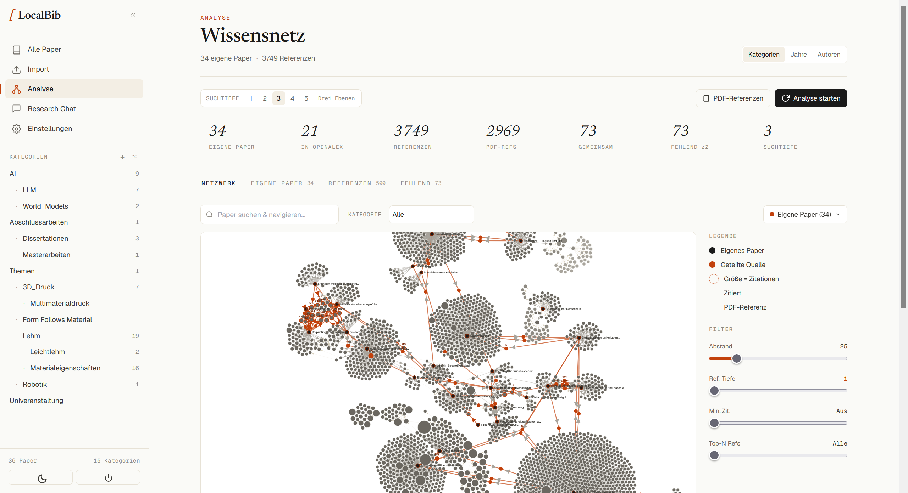
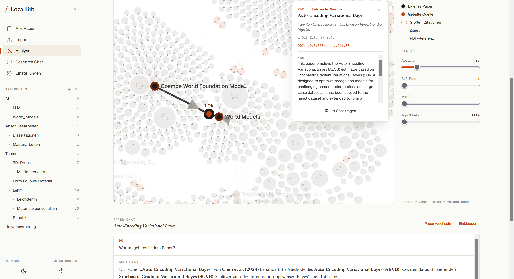
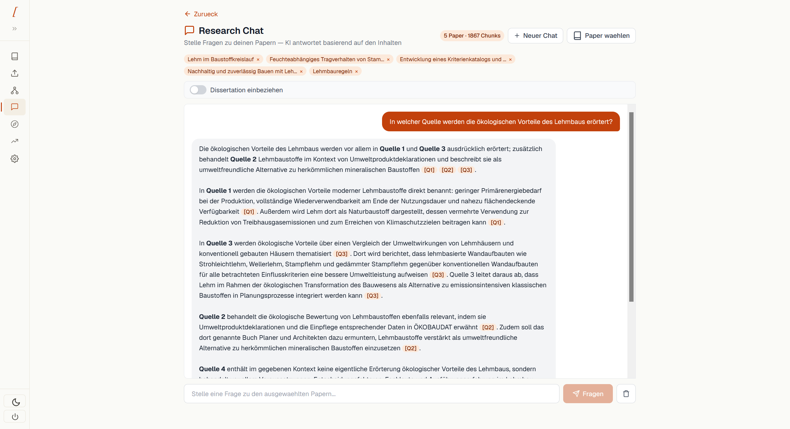
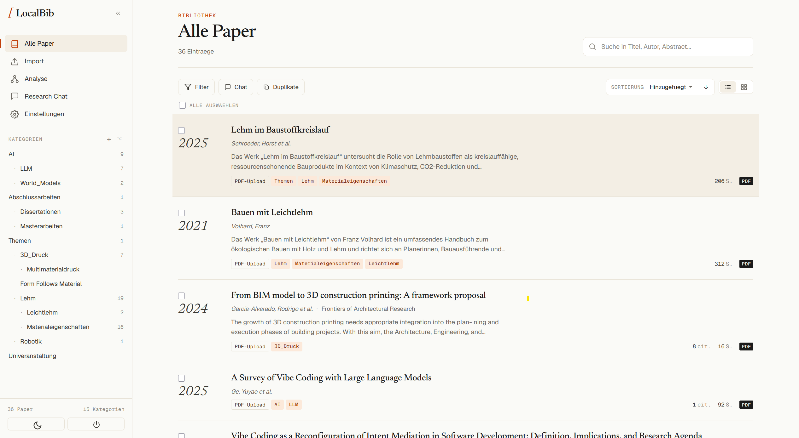
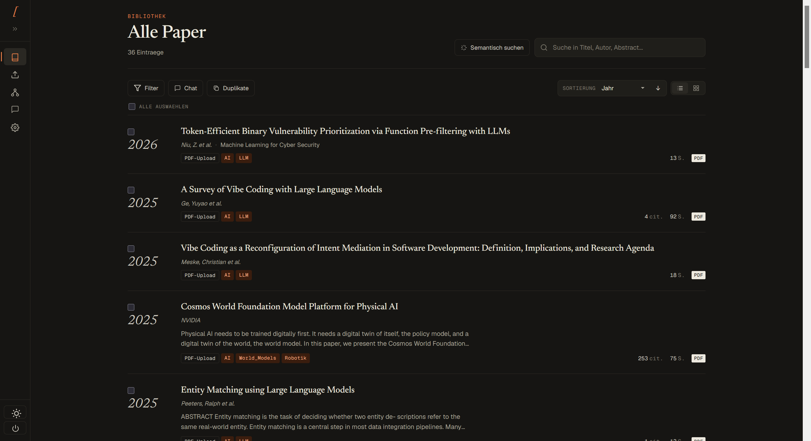

# LocalBib

**Automatic tagging and categorisation of academic PDFs** — for doctoral
researchers, students and anyone who wants a growing PDF collection to stay
searchable and categorised without logging into a cloud reference manager.
PDFs land in a folder, LocalBib detects the DOI, fetches title/authors/abstract
from CrossRef, lets an LLM of your choice assign the categories, and creates
symlinks in your own folder structure. Everything runs locally, on your
machine, in your own SQLite database.

**Source code (AGPL-3.0)** — free to use, free to self-host, no feature gating,
no forced account. A precompiled **Windows installer (.exe)** is available as a
convenience build for anyone who would rather not set up Python.

---

## Screenshots

<p align="center">
  <a href="static/screenshots/wissensnetz.png">
    
  </a><br>
  <sub><b>Knowledge network</b> — what your collection cites and where it overlaps.
  Search depth 1–5, shared sources highlighted, missing items made visible.</sub>
</p>

<table>
  <tr>
    <td width="50%" valign="top">
      <a href="static/screenshots/paper-chat.png">
        
      </a><br>
      <sub><b>Item chat from the graph</b> — click a node, read the abstract,
      keep asking about that item right there.</sub>
    </td>
    <td width="50%" valign="top">
      <a href="static/screenshots/research-chat.png">
        
      </a><br>
      <sub><b>Research Chat</b> — questions across many items, every statement
      backed by the passage it came from.</sub>
    </td>
  </tr>
  <tr>
    <td width="50%" valign="top">
      <a href="static/screenshots/bibliothek.png">
        
      </a><br>
      <sub><b>Library</b> — every item with year, authors, an abstract snippet and
      automatically assigned categories; the sidebar keeps count.</sub>
    </td>
    <td width="50%" valign="top">
      <a href="static/screenshots/bibliothek-dark.png">
        
      </a><br>
      <sub><b>Dark mode</b> — the same view at night, including semantic search
      that finds things without a literal keyword match.</sub>
    </td>
  </tr>
</table>

---

## Download the app (Windows installer)

> **A finished Windows program — no Python, no terminal required.**

**Try it free for 14 days, without a license key.** Download the installer,
install it, and use every feature for 14 days without restrictions.

[**Buy LocalBib (€29.50, one-off)**](https://buy.polar.sh/polar_cl_ElgxYcLFsyVN4g0xWdBBGEV0tVh92y7XskHaS1hDgBD)

After that the app asks once for a license key:

- **€29.50 one-off**, no subscription, lifetime updates included.
- One key covers **2 devices** (activations).
- The key is checked against the Polar store **exactly once** — after that
  LocalBib **keeps running offline forever**, with no re-check, no forced
  internet connection, and no telemetry.
- No purchase required to try it: the 14-day trial runs without any
  registration.

The installer itself is published as the GitHub release asset
`LocalBib-Setup-<version>.exe` under this repository's
[Releases](https://github.com/tobiasbartlog/localbib/releases) — publicly
visible and verifiable at any time against the source code belonging to that
tag.

### About the SmartScreen warning

The installer is **not code-signed** (code signing is a recurring cost a solo
project would rather not carry before its first revenue). Windows therefore
shows SmartScreen on first launch:

1. **"Windows protected your PC"**
2. Click **"More info"**
3. Click **"Run anyway"**

That is normal for unsigned but open-source software — the complete source code
is in this repository and can be inspected at any time. If you would rather not
trust the installer at all: self-hosting from source, below, needs no installer.

---

## Features

- **Watchdog**: watches an input folder — drop PDFs in, done
- **DOI extraction**: automatic DOI detection plus CrossRef metadata (title, authors, abstract, …)
- **OCR fallback**: text even from scanned PDFs
- **LLM categorisation**: automatic assignment to categories via the LLM provider of your choice
- **Citation network**: discover related work through OpenAlex
- **Semantic search**: hybrid of embeddings + BM25 (optional, only with an embedding model configured)
- **SQLite database**: all metadata and assignments, no cloud
- **Symlinks**: category folders linking to the PDFs
- **BibTeX export**: straight out of the database
- **Automatic renaming**: `YYYY_Lastname_Title.pdf`
- **Bilingual interface**: English and German, switchable in the settings

---

## Self-host (Python) — never gated, never on trial, never asked for a key

A self-hosted install from source is never bound to a trial or a license key —
the AGPL freedoms stay real, not just on paper.

### Installation

```bash
# Clone the repository
git clone https://github.com/tobiasbartlog/localbib.git
cd localbib

# Install dependencies
pip install -r requirements.txt

# Optional, for Windows shortcuts:
pip install pywin32

# Create the .env file
copy .env.template .env   # Windows
cp .env.template .env     # Linux/Mac
```

### Bring your own LLM key

LocalBib deliberately ships **no** LLM provider and **no** API key — you bring
your own, from a provider of your choice. The first-run onboarding asks for it;
you can skip that (the app stays usable, only the LLM features stay off) and
set it up later under **Settings → LLM**. There you keep any number of
*connections* (a provider account or a local endpoint, key optional) and bind
the three *roles* — Reasoning, Simple tasks, Embedding — each to a connection
and a model. Roles are independent: reasoning can run on OpenAI while
embeddings run on a local Ollama. The configuration lives in `llm.json` next
to your `.env`; keys never leave your machine.

| Provider | Preset | Get a key |
|----------|--------|-----------|
| OpenAI | `openai` | https://platform.openai.com/api-keys |
| OpenRouter (many models, one key) | `openrouter` | https://openrouter.ai/keys |
| Groq | `groq` | https://console.groq.com/keys |
| DeepSeek | `deepseek` | https://platform.deepseek.com/api_keys |
| Mistral | `mistral` | https://console.mistral.ai/api-keys |
| Local/own endpoint (e.g. Ollama) | `custom` + base URL | — (no key needed) |

An older `.env` with `LLM_PROVIDER` / `LLM_API_KEY` / `LLM_MODEL` is picked up
on start as one connection "default"; saving the LLM tab once moves it into
`llm.json` and removes those keys from the `.env`.

Optional but recommended: `CROSSREF_MAILTO` — your own email address for the
CrossRef/OpenAlex "polite pool" (better rate limits). Leaving it empty means no
address is sent; no substitute is slipped in.

The interface language lives in `UI_LANGUAGE` (`en` or `de`, default `en`) and
can also be switched at any time under Settings → Appearance.

### Start the web UI

```bash
python webapp.py
# → open in a browser: http://localhost:8000
```

### Quick start (CLI)

```bash
# 1. Initialise the database and categories
python literature_manager.py init

# 2. Put PDFs into the input folder
#    Default: ~/Literatur/input/

# 3a. Import once
python literature_manager.py import

# 3b. OR: watch the folder continuously
python literature_manager.py watch
```

### Folder structure

```
~/Literatur/
├── input/                  ← drop PDFs in here
├── all/                    ← all PDFs (renamed)
├── kategorien/
│   ├── Themen/
│   │   ├── Lehm/           ← symlinks
│   │   ├── 3D_Druck/
│   │   ├── Materialeigenschaften/
│   │   └── Dissertationen/
│   ├── AI/
│   │   ├── LLM/
│   │   └── World_Models/
│   └── Dissertationen_Sammlung/
├── literatur.db            ← SQLite database
└── literatur.bib           ← BibTeX (after export)
```

### All commands

| Command | Description |
|---------|-------------|
| `init` | Create the database and the default categories |
| `import` | Process the PDFs in the input folder |
| `watch` | Watch the input folder continuously |
| `list` | Show all items |
| `search "query"` | Search items |
| `categories` | Show categories |
| `add-cat "Name" --parent ID --desc "..." --keywords "..."` | New category |
| `bibtex [--output file.bib]` | Export BibTeX |
| `rebuild` | Rebuild folders and symlinks |
| `stats` | Statistics |

### Options

```bash
# A different base directory
python literature_manager.py --dir "D:/Dissertation/Literatur" init

# Verbose/debug mode
python literature_manager.py -v watch
```

### Managing categories

```bash
# Add a subcategory (parent=1 is "Themen")
python literature_manager.py add-cat "Sustainability" --parent 1 --desc "EPD, LCA, life-cycle assessment" --keywords "sustainability, LCA, EPD, carbon"

# A new top-level category
python literature_manager.py add-cat "Methodology" --desc "Research methods"
```

### Pipeline

```
PDF in the input folder
  → SHA256 hash (duplicate check)
  → extract text (PyMuPDF)
  → find the DOI by regex
  → CrossRef API → metadata (title, authors, year, abstract, journal)
  → fallback: ISBN, year from the text
  → LLM → assign categories
  → rename the file → copy into /all/
  → create symlinks in the category folders
  → delete the original from /input/
```

---

## Agent API (external research)

Lean JSON endpoints so an external agent (e.g. Claude Code in another project)
can query the library with `curl` — no browser, no session, no UI ballast.
Prerequisite: `python webapp.py` is running.

- **Search** (`/api/search/semantic`, `/api/search/passages`): semantic
  (embeddings) + lexical (BM25), combined via reciprocal rank fusion. If the
  Embedding role is not bound, or the library is not indexed yet, the
  search falls back to purely lexical without comment (response field `"mode"`:
  `"semantic"` / `"hybrid"` / `"bm25"`) — never a 500.
- **Lookup by cite key** (`/api/search/reference/{citekey}`): resolves a search
  hit to full metadata plus abstract.
- **Chunk lookup by cite key** (`/api/search/reference/{citekey}/chunks`):
  paginated access to an item's raw text passages (with `page_start`/`page_end`
  — directly quotable).

```bash
# Item level: which items are relevant?
curl "http://localhost:8000/api/search/semantic?q=earth+3D+printing+layer+adhesion&top_k=5"

# Passage level: which passage supports that?
curl "http://localhost:8000/api/search/passages?q=earth+3D+printing+layer+adhesion&top_k=5"

# Full metadata plus abstract for one hit
curl "http://localhost:8000/api/search/reference/Smith2023"

# Raw chunks of the same item, page by page
curl "http://localhost:8000/api/search/reference/Smith2023/chunks?limit=20&offset=0"
```

Both search endpoints also accept `POST` with a JSON body (`{"q": "...",
"top_k": 10}`) for long or multi-line queries.

Plugins reach the same semantics through
`plugin_api.LibraryApi.search_references()` — semantically ranked when an
embedding model is configured and the library is indexed, lexical fallback
otherwise (additive, no breaking change for existing plugins).

---

## Add-ons in development (Dev-Suchpfad)

Add-ons are Bundles — a folder with a `plugin.json` Manifest, a Python package
named after the Add-on id and an optional `frontend/` — that the core loads at
runtime. They are not compiled into the `.exe`. Besides the installed Bundles,
the core loads every folder on a **Dev-Suchpfad**:

```bash
# .env (or the environment); several folders separated by ; on Windows, : elsewhere
LOCALBIB_PLUGIN_DEV_PATHS=path/to/my-addon
```

Without a Dev-Suchpfad the core starts without that Add-on, silently. With it,
the Add-on shows up under Settings -> Add-ons; switching it on asks for consent
to the Berechtigungen its Manifest declares, and its settings (folders, keys)
are edited there too. Its API lives under `/api/plugins/<id>/`, its data in the
Add-on's own folder.

An Add-on's own checks run without the core:

```bash
localbib-addon check path/to/my-addon          # Manifest, structure, locales
cd path/to/my-addon && lint-imports            # imports only plugin_api
pytest path/to/my-addon/tests                  # contract fakes, no core
```
---

## License

Copyright © 2026 Tobias Bartlog. The repository carries **two** licenses:

| Area | License | File |
|------|---------|------|
| The entire core (app, backend, SPA, CLI) | **AGPL-3.0** | [`LICENSE`](LICENSE) |
| The plugin contract package `plugin_api/` | **MIT** | [`plugin_api/LICENSE`](plugin_api/LICENSE) |

AGPL-3.0 for the core, because PyMuPDF (the PDF engine) is AGPL. The source
code is free to use, to audit and to build yourself — there is no feature
gating, no stripped-down community edition and no forced account. The Windows
installer above is a paid *convenience* build of the same software, not an
additional feature.

### Plugins and the plugin API

`plugin_api/` is deliberately **MIT**, separate from the AGPL core: anyone
writing their own plugin against this contract can **license it freely** — the
contract itself imposes no license on the plugin.

Note that a plugin is loaded by the core via `importlib` and runs **in-process**
with the AGPL core. For that constellation an **AGPL-compatible license for the
plugin is recommended**. This is a recommendation, not legal advice; anyone who
wants to ship a plugin under different terms should clarify that themselves.

**The plugin API is declared stable.** `plugin_api` contains nothing but
protocols and dataclasses (contracts, no runtime logic) and is versioned
through an `API_VERSION` constant (currently `1`); a plugin declares the
minimum it needs in its manifest. A breaking change to the interfaces raises
`API_VERSION` — existing plugins do not break silently.

Deliberately *not* decided: there is no plugin exception clause on the AGPL
core (which would make proprietary in-process plugins unambiguously
permissible); the MIT split of `plugin_api/` keeps that door open without
settling the question today. Switching the PDF engine (`pypdfium2` instead of
PyMuPDF), which would free the core from the AGPL obligation, remains a future
option but is unbuilt.

---

## Legal

[Imprint and privacy policy](https://tobiasbartlog.github.io/literature-manager-v3/legal/)

Contact: [support@localbib.com](mailto:support@localbib.com) · https://localbib.com
